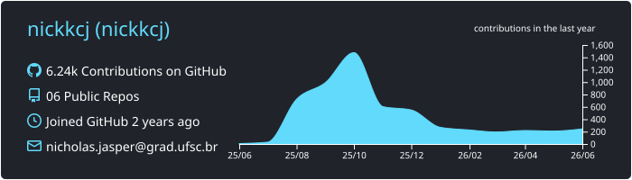
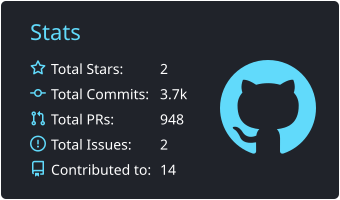

<h1 align="center">Hey 👋 I'm Nicholas Jasper</h1>

  <strong>Software Engineer @ DOOOR</strong> | Dual Citizen (🇧🇷/🇩🇪)  
  I build high-performance backend systems, scalable AI infrastructure, and optimize cloud costs.

###

  

###

  
  
  

###

<h3 align="center">Certifications</h3>

  

  <strong>AWS Certified Solutions Architect &ndash; Associate</strong>
   
  

###

  
  
  

###

<picture>
  <source media="(prefers-color-scheme: dark)" srcset="https://raw.githubusercontent.com/Nickkcj/Nickkcj/output/pacman-contribution-graph-dark.svg">
  <source media="(prefers-color-scheme: light)" srcset="https://raw.githubusercontent.com/Nickkcj/Nickkcj/output/pacman-contribution-graph.svg">
  
</picture>

###
